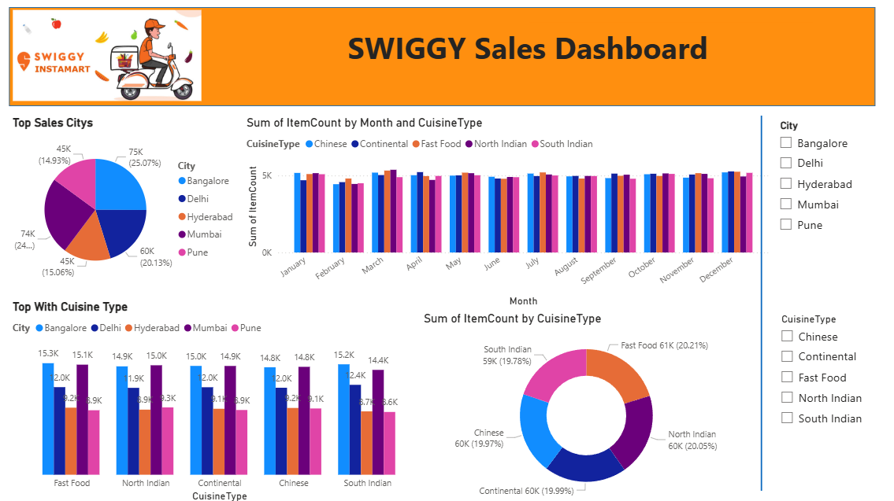

# 🍔 Swiggy Sales Analysis Dashboard

## 📊 Food Delivery Sales & Business Insights Dashboard


---

## 📌 Project Overview

The **Swiggy Sales Analysis Dashboard** is a business intelligence project focused on analyzing food delivery sales data to uncover valuable insights related to revenue, customer behavior, restaurant performance, and delivery operations.

This dashboard helps users monitor KPIs, track sales trends, and make data-driven business decisions using interactive visualizations.

---

# 📸 Dashboard Preview



---

## 🚀 Features

* 📊 Interactive sales dashboard
* 📈 Revenue and order trend analysis
* 🍔 Top-performing restaurants analysis
* 👥 Customer behavior insights
* 🚚 Delivery performance tracking
* 📅 Monthly & yearly sales comparison
* 🔍 Dynamic filters for better analysis

---

## 🛠️ Tools & Technologies

| Tool                 | Purpose               |
| -------------------- | --------------------- |
| Power BI             | Dashboard Development |
| SQL                  | Data Querying         |
| Python               | Data Analysis         |
| Excel                | Data Cleaning         |
| Matplotlib & Seaborn | Data Visualization    |

---

## 📂 Dataset Information

The dataset contains:

* Order Details
* Restaurant Information
* Customer Data
* Delivery Time
* Revenue Metrics
* Ratings & Reviews
* Payment Methods

---

## 📊 Key Insights

* Identified top-performing restaurants based on sales
* Analyzed customer ordering behavior
* Tracked delivery delays and efficiency
* Compared monthly revenue growth trends
* Visualized category-wise order distribution

---

## 📁 Project Structure

```bash
Swiggy-Sales-Analysis-Dashboard/
│
├── data/
├── dashboard/
├── images/
├── sql/
└── README.md
```

---

## ⚡ Getting Started

```bash
git clone https://github.com/your-username/Swiggy-Sales-Analysis-Dashboard.git
```

1. Open the Power BI dashboard file
2. Load the dataset if required
3. Explore interactive reports and filters

---

## 🎯 Project Objective

The goal of this project is to analyze food delivery business performance and provide actionable insights through interactive dashboard visualizations.

---

## 🤝 Contributing

Contributions are welcome.
Feel free to fork this repository and submit pull requests.

---

## 📧 Contact

**Your Name**
GitHub: https://github.com/your-username

---

## ⭐ Support

If you found this project useful, give it a ⭐ on GitHub.
